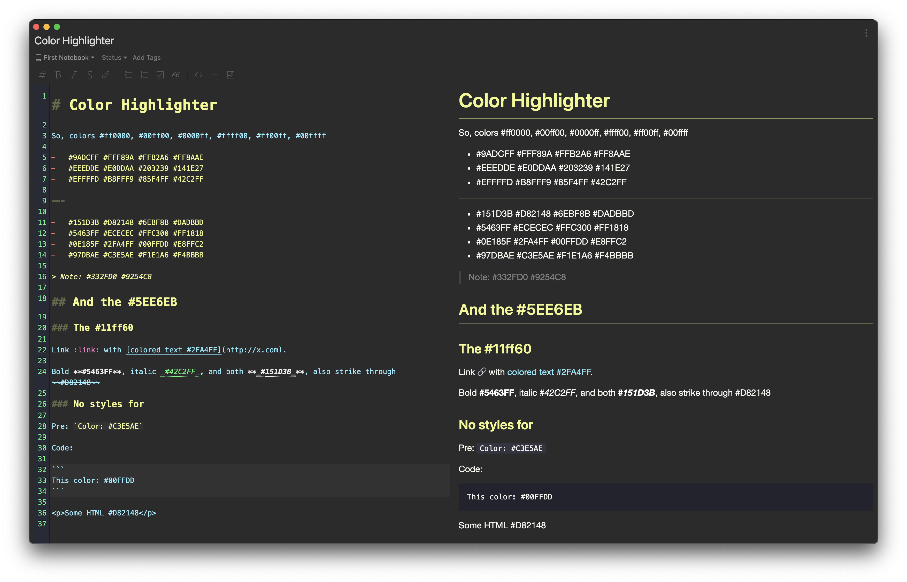
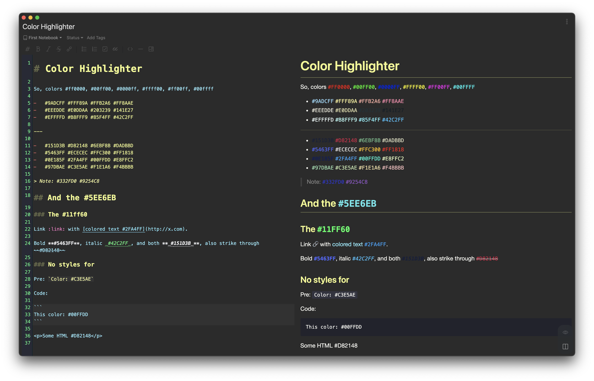
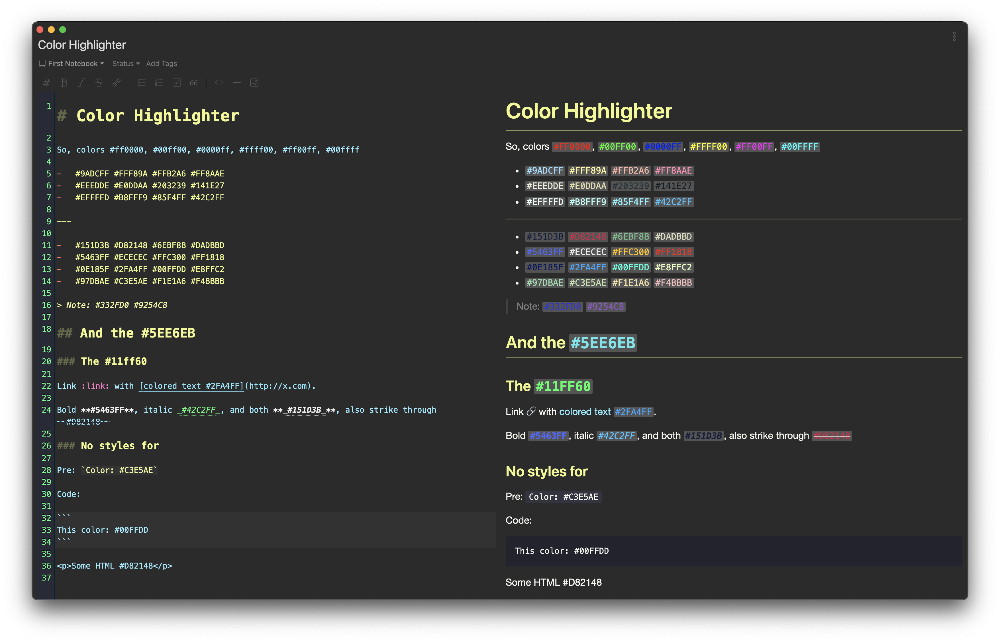
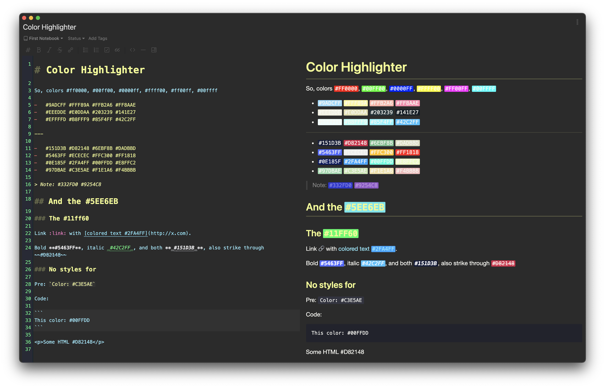

# Color Highlighter

[](https://my.inkdrop.app/plugins/color-highlighter)
[](https://my.inkdrop.app/plugins/color-highlighter)
[](https://github.com/mymmrac/inkdrop-color-highlighter/blob/master/LICENSE)

Highlights color codes inside your text.

## Install

```console
ipm install color-highlighter
```

## Usage

Simply install the plugin to make it work. There are some settings available (both from plugin settings and context menu on top):

- Enabled `color-highlighter:toggle` - quick enable / disable
- Monospaced Font `color-highlighter:monospaced-font-toggle` - enable / disable monospaced font
- Diplay Mode - change appiarence of color codes
    - Colored Text `color-highlighter:colored-text-mode` - changes color of color codes text
    - Colored Text + Background `color-highlighter:colored-text-background-mode` - changes color of color codes text and adds backgound
    - Colored Background - `color-highlighter:colored-background-mode` - adds colored background to color codes text
- Text Case - change case of color codes text
    - No Case Change `color-highlighter:text-no-case-change` - does not change text case
    - To Uppercase `color-highlighter:text-to-uppercase` - makes all color codes text uppercase
    - To Lowercase `color-highlighter:text-to-lowercase` - makes all color codes text lowercase

Context menu on `preview` allows to quickly toggle plugin. Top level `Plugin` menu allows quicky change almost all settings.

## Preview


<p align="center">Disabled</p>


<p align="center">Colored Text</p>


<p align="center">Colored Text + Background</p>


<p align="center">Colored Background</p>

