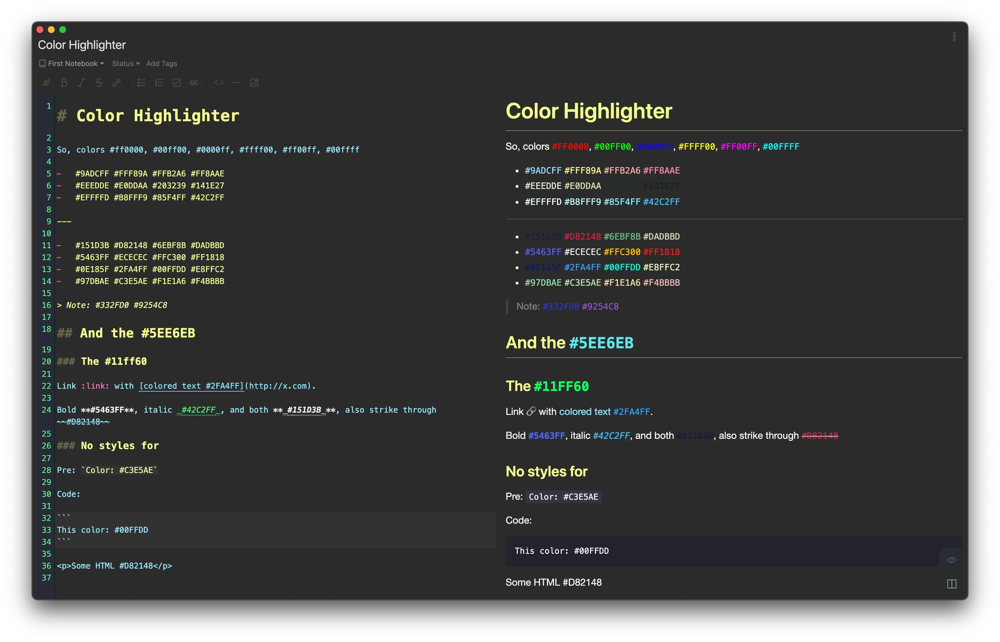
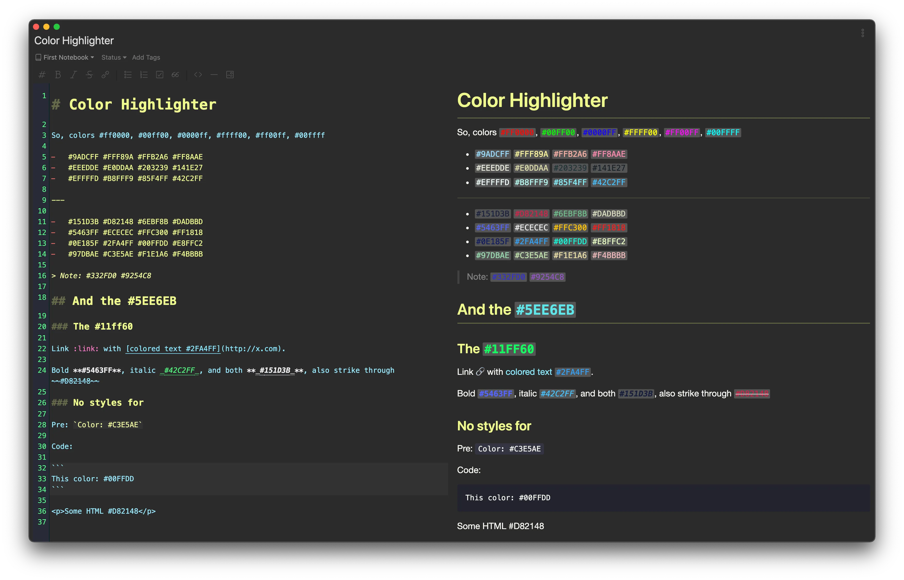
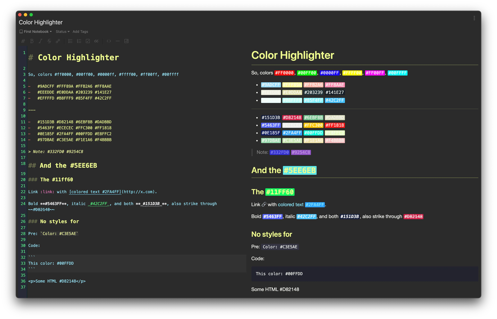
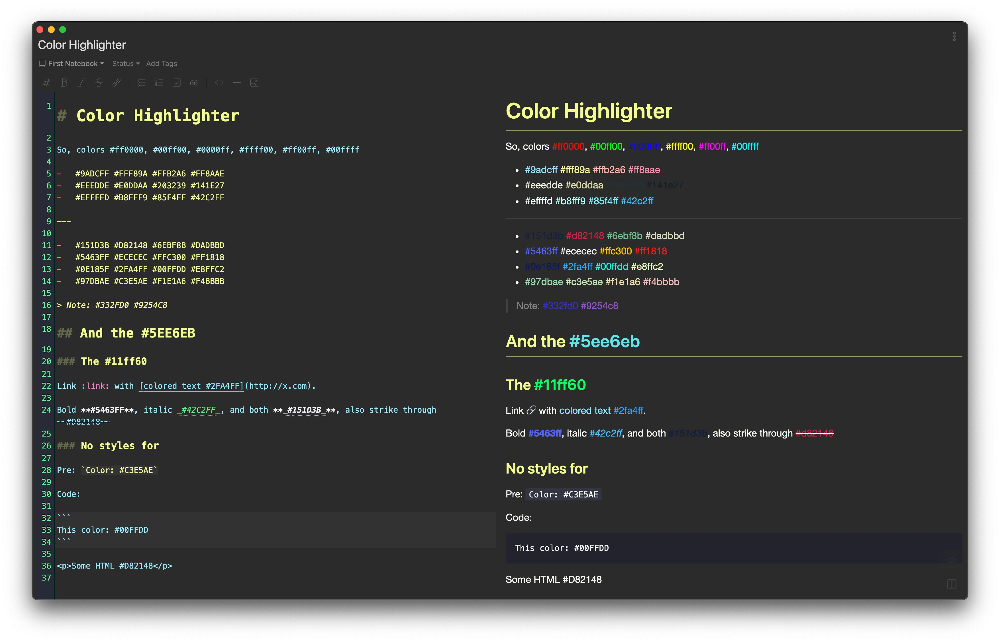

# Color Highlighter

[](https://my.inkdrop.app/plugins/color-highlighter)
[](https://my.inkdrop.app/plugins/color-highlighter)
[](https://github.com/mymmrac/inkdrop-color-highlighter/blob/master/LICENSE)

Highlights color codes inside your text.

## 🧩 Install

```console
ipm install color-highlighter
```

## 🍀 Usage

Simply install the plugin to make it work.

|                  Disabled                  |                      Enabled                       |
|:------------------------------------------:|:--------------------------------------------------:|
|  |  |

## ⚙️ Settings

There are some settings available (both from plugin settings and context menu on top).

Context menu on `preview` allows to quickly toggle plugin. Top level `Plugin` menu allows quickly change almost all settings.

> Note: Most available settings have related to them commands.

| Setting                     | Command                                          | Description                                                          |
| --------------------------- | ------------------------------------------------ | -------------------------------------------------------------------- |
| Enabled                     | `color-highlighter:toggle`                       | Quick enable / disable                                               |
| Monospaced Font             | `color-highlighter:monospaced-font-toggle`       | Enable / disable monospaced font                                     |
| Display Mode                | ▼                                                | Change appearance of color codes                                     |
| ➤ Colored Text              | `color-highlighter:colored-text-mode`            | Changes color of color codes text                                    |
| ➤ Colored Text + Background | `color-highlighter:colored-text-background-mode` | Changes color of color codes text and adds background                |
| ➤ Colored Background        | `color-highlighter:colored-background-mode`      | Adds colored background to color codes text                          |
| Text Case                   | ▼                                                | Change case of color codes text                                      |
| ➤ No Case Change            | `color-highlighter:text-no-case-change`          | Does not change text case                                            |
| ➤ To Uppercase              | `color-highlighter:text-to-uppercase`            | Makes all color codes text uppercase                                 |
| ➤ To Lowercase              | `color-highlighter:text-to-lowercase`            | Makes all color codes text lowercase                                 |
| Background Color            | -                                                | Changes background color in "Colored Text + Background" display mode | 

## 🖼️ Preview

> Display Mode: Colored Text + Background



> Display Mode: Colored Background



> Monospaced Font: Disabled



> Text Case: To Lowercase


